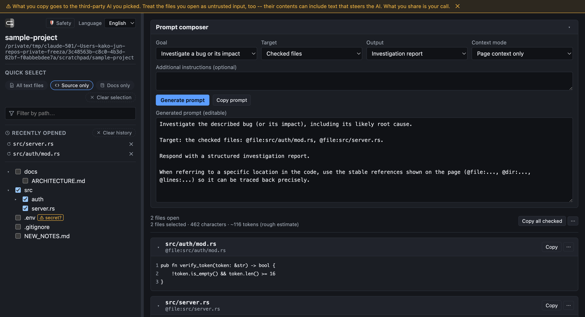

# prompt-builder-for-sidebar-ai

A local browser that builds prompts for sidebar AI from your files.

> [!WARNING]
> **Use at your own risk.** This tool serves files from a directory you
> choose over a local (loopback-only) web server, and helps you copy their
> content into a prompt. It relies entirely on your own judgment about what
> to select and where to paste it:
> - Anything you select and copy can be pasted into a third-party AI product
>   this tool has no relationship with or control over. Consider what you're
>   about to share before you share it -- secrets, credentials, and private
>   data included.
> - File content is untrusted input from this tool's perspective. A file can
>   contain text written to manipulate whatever AI later reads the copied
>   prompt ("prompt injection"). This tool cannot detect or prevent that.
>
> See [THREAT_MODEL.md](THREAT_MODEL.md) for the detailed threat model,
> mitigations, and what's explicitly out of scope.



## Installation

```console
cargo install prompt-builder-for-sidebar-ai
```

Requires the Rust toolchain (`cargo`). This installs the
`prompt-builder-for-sidebar-ai` binary; see [Usage](#usage) below to run it.

To build from a local checkout of this repository instead:

```console
git clone https://github.com/kako-jun/prompt-builder-for-sidebar-ai
cd prompt-builder-for-sidebar-ai
cargo run -- [ROOT]
```

## Usage

```console
prompt-builder-for-sidebar-ai [ROOT]
```

- `ROOT` is an optional directory to serve, or a public GitHub repository URL; it defaults to the current directory (`.`).
- The root must exist and be a directory; otherwise the command prints an error and exits non-zero.
- The server binds to an available port on `127.0.0.1` only (loopback, no external exposure).
- An unguessable session URL (`http://127.0.0.1:<port>/<token>`) is printed and opened in your default browser. Only that exact path responds; every other path returns 404.
- Press Ctrl+C to shut the server down cleanly.

Example:

```console
prompt-builder-for-sidebar-ai .
prompt-builder-for-sidebar-ai ~/repos/my-project
```

### Serving a GitHub repository URL

`ROOT` also accepts a public GitHub repository URL --
`https://github.com/{owner}/{repo}`, optionally with a `.git` suffix or a
`/tree/{ref}` suffix to check out a specific branch or tag:

```console
prompt-builder-for-sidebar-ai https://github.com/owner/repo
prompt-builder-for-sidebar-ai https://github.com/owner/repo/tree/some-branch
```

This shallow-clones (`git clone --depth 1`) the repository into a temporary
directory and serves it exactly like any other local root -- `git` must be
installed and on `PATH`. Only public repositories are supported; a private
repository, a nonexistent repository or ref, and a network failure all
surface as the same clone error (git's own message is included). The
temporary clone is removed automatically when the server exits, including
after Ctrl+C.

### Opening another folder

The **Open another folder** button next to the root name shows a native
folder-selection dialog from the local backend -- the browser itself is
never given arbitrary filesystem access. Confirming a folder in that dialog
is the confirmation; there is no separate in-page "are you sure" step.
Canceling the dialog leaves the current root untouched. Picking a folder
replaces the explorer root (rebuilding the tree and clearing every checked
file, open panel and its collapsed/cached state, the recently-opened-files
list, and the generated prompt from the previous root -- none of it stays
reachable through the running session afterwards) and, if the session was
started from a GitHub URL, discards the now-unused temporary clone
immediately rather than waiting for the process to exit.

This relies on a native dialog crate ([`rfd`](https://docs.rs/rfd)), which
needs a running desktop session. On Linux specifically, with neither
`$DISPLAY` nor `$WAYLAND_DISPLAY` set (an SSH session with no X11
forwarding, a headless server, ...) there is no windowing system to show a
dialog in at all; the button reports this plainly instead of silently doing
nothing, and the workaround is the same as always -- start a new instance
with a different `ROOT` argument.

## Limitations

This is an MVP; the current scope is intentionally narrow:

- **File and line-range references only** (`@file:...`, `@dir:...`,
  `@lines:...`). Symbol-level references (`@symbol:...`, e.g. "this
  function") aren't implemented.
- **No image mode.** Non-text files are excluded from the explorer, not
  previewed.
- **English and Japanese only**, for both the UI and the generated prompt
  text. There's no mechanism to add further languages short of editing the
  message catalog in `assets/app.js`.
- **Heuristic secret detection.** The `.env`/likely-secret flag is a small,
  hand-picked name pattern, not exhaustive scanning -- see
  [docs/API.md](docs/API.md#known-limitations) for the full list of
  detection and Git-diff edge cases.

## Troubleshooting

- **The browser didn't open automatically.** The terminal output includes
  the session URL (`http://127.0.0.1:<port>/<token>`) -- open it manually.
  This can happen if no default browser is configured, or in some sandboxed
  environments.
- **"Copy" didn't do anything, or the button shows a failure state.** Some
  browser contexts (an insecure origin other than `localhost`, certain
  in-app browsers, or a page not in a focused/foreground tab in some
  browsers) restrict the Clipboard API. The copy buttons report this
  explicitly, and a page-level toast repeats the failure so it's visible
  even if the specific button has since scrolled out of view or been
  removed from the DOM (e.g. after changing the selection). There's no
  automatic fallback to a plain-text `<textarea>` selection; retry after
  bringing the tab into focus, or use the **Generated prompt (editable)**
  box and manually select + copy its text instead, which uses ordinary
  browser text selection rather than the Clipboard API.
- **A GitHub URL `ROOT` fails to clone.** Confirm `git` is on `PATH`,
  the repository is public, and the ref (branch/tag) exists -- private
  repos, nonexistent repos/refs, and network failures all surface as the
  same clone error, with git's own message included for detail.
- **Git diff shows nothing for a brand-new repository.** A repository with
  no commits yet, that also has something staged, is a known gap:
  `git diff HEAD` has no `HEAD` to diff against. Commit once, or see
  [docs/API.md](docs/API.md#known-limitations) for the exact behavior.
- **A file you expect to see isn't in the explorer.** Check `.gitignore` --
  it's applied the same way `git` itself would exclude paths. Binary files
  (detected heuristically) and files over the size cap are excluded too;
  see [docs/API.md](docs/API.md).
- **"Open another folder" says no dialog is available.** This happens on
  Linux when neither `$DISPLAY` nor `$WAYLAND_DISPLAY` is set (e.g. an SSH
  session with no X11 forwarding, a headless server) -- there's no
  windowing system to show a folder-picker dialog in. Start a new instance
  with a different `ROOT` argument instead.

## Documentation

- [docs/EXPLORER_UI.md](docs/EXPLORER_UI.md) -- the two-pane explorer, the
  embedded app icon (inlined as the favicon and the explorer-pane logo, so no
  extra request and no `/favicon.ico` 404), the English/Japanese language
  toggle, line numbers and stable `@file`/`@dir`/`@lines` references, copy
  actions and output formats, the prompt composer, and selection size
  statistics.
- [docs/API.md](docs/API.md) -- the `/api/root`, `/api/tree`, `/api/file`,
  and `/api/diff` endpoints, what's excluded from the tree, how likely-secret
  files are flagged, and known limitations.
- [THREAT_MODEL.md](THREAT_MODEL.md) -- assets, trust boundaries, threats and
  mitigations, and what's explicitly out of scope.